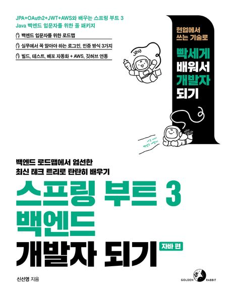

# 스프링 부트 3 백엔드 개발자 되기: 자바편

[도서 링크](https://product.kyobobook.co.kr/detail/S000201766024)

# 🛠 기술 스택
- 언어: Java17
- 프레임워크: Spring Boot 3
- ORM: JPA, Spring Data JPA
- 템플릿 엔진: Thymeleaf
- 보안: Spring Security, JWT, OAuth2
- CI/CD: GitHub Actions